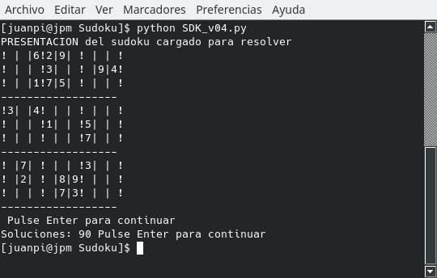

## Acerca  

Implementación de un algoritmo para la resolución de Sudokus cuadrados **de cualquier dimensión (4x4, 9x9, 16x16, 25x25, 36x36, ….)**. Siempre que definamos sus elementos con un solo carácter (letras, números, caracteres especiales) la dimensión es sólo cuestión de alimentar al SW.

### Sudoku de 4x4

***
### Sudoku de 9x9

***
### Sudoku de 16x16

***
### Sudoku de 25x25

### Y así sucesivamente ...
***
#### El sudoku  que podemos pasarle al algoritmo puede: Estar mal planteado, es decir, sin solución. Bien planteado con una única solución. O con múltiples soluciones y dándonos todas las que pidamos.

***
#### Permite hacer un seguimiento de cómo evoluciona el algoritmo en la resolución.

***
#### Reporta un informe en un archivo con el grado de dificultad de la resolución y por supuesto su solución/es.

#### Para todo ello tendrás el fichero **sdk.ini** para comunicarte con él, como si fuera un cuadro de mando.

# Construcción
Esta construido en Python versión 3.

## Las Versiones:

Son las diferentes progresiones de este SW que se construyeron para solucionar el reto.

No esperéis un entorno GUI,sino que se trata de programación estructurada apoyada con funciones en entorno de consola. Doy por supuesto que se tienen conocimientos de python, qué es una consola y cómo se lanza un programa en python desde la misma.
 
### SDK_v01.py
**Versión 01**  
Trata de resolver un sudoku con 2 estrategias. No está implementado el modulo de Fuerza Bruta. Los valores de configuración del sudoku están cargados en el propio programa, en este caso un Sudoku de 9 x 9. El planteamiento de resolución es independiente del tipo de sudoku. Es capaz de solucionar algunos sudokus en los que su nivel de dificultad no sea alto.

### SDK_v02.py
**Versión 02**  
Esta versión amplia la anterior  implementando parte de la configuración a través del fichero <sdk.ini> y el módulo de resolución por Fuerza Bruta. Esta versión es Plenamente Operativa.

### SDK_v03.py
**Versión 03**  
En esta versión se pondrán en marcha todos los elementos del fichero de configuración <sdk.ini> y se almacenarán sus resultados en archivo. Esta versión es Completa y Plenamente Operativa.

###SDK_v04.py
**Versión 04**  
Esta versión amplia la versión anterior implementado una nueva estrategia de solución, antes de pasar a Fuerza Bruta. Estrategia PAR DESNUDO o DOBLE PAREJA.

# Como correrlo
Como puede resolver sudokus cuadrados de cualquier dimensión, previo a ejecutarlo, has de informar al programa del sudoku que quieres resolver a través del fichero **sdk**.

***
También deberás  informarle  de que tipo de sudoku se trata (4x4, 9x9, 16x16, ...), de las soluciones que quieres, donde quieres las mismas... todo esto a través del fichero comentado anteriormente **sdk.ini**.  

***
Para ejecutarlo:

## Si estás interesado en seguir adelante
### No olvides leer el pdf que te adjunto: Objetivo_SUDOKU.pdf

